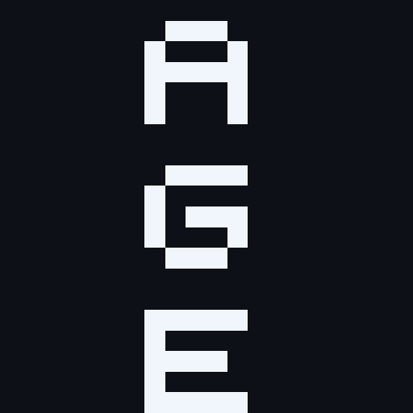

<p align="center">
  
</p>

<h1 align="center">Auae Game Engine</h1>

<p align="center">
  <em>A compact 2D game engine for .NET 10 — ECS core, Silk.NET renderer, DI-first design.</em>
</p>

<p align="center">
  <a href="https://github.com/Albuka1/Age/actions/workflows/ci.yml"></a>
  <a href="https://albuka1.github.io/AGE/"></a>
  
  
  
</p>

---

AGE is a small, opinionated 2D engine written in C#. It pairs an
entity-component-system core with a Silk.NET + OpenGL 3.3 renderer, a
dependency-injection service model, and a testable design where the renderer
is the only piece that ever touches the GPU.

It is not a Unity competitor. It is what you reach for when you want to
understand every line, ship a focused 2D game, and not fight a 500 MB editor.

## Highlights

- **ECS core.** `World` owns entity ids and struct components. `SystemPipeline`
  runs an ordered list of `ISystem` instances once per update step.
- **Renderer that stays out of the way.** Silk.NET window + OpenGL 3.3 core,
  a minimal sprite batch, and a retained UI pass — all behind `IRenderer`.
- **Sandboxed assets.** `IAssetLoader` resolves every path inside the game root
  and rejects traversal; image and audio decoding are separate services.
- **Audio built in.** WAVE, MP3 and Ogg Vorbis decoding through `Age.Audio`,
  playback through OpenAL. Drop `AddAgeOpenALAudio` on headless machines and
  it stays silent.
- **Scene serialization.** Worlds round-trip through JSON with a
  `JsonSerializerContext`, so the format is AOT-friendly by construction.
- **DI-first.** Every subsystem registers through an `AddAge*` extension.
  `World` is deliberately *not* in the container — its lifetime belongs to the
  caller.
- **Time you can stop.** `FixedTimestep` is the clock of the game as well: `Paused` stops the
  simulation without stopping the frames, `TimeScale` slows it down or speeds it up, and `Tick`
  counts the steps. Behaviour that follows the display rather than the simulation implements
  `IFrameSystem`, so a paused game still moves its menu, its camera and its overlays.
- **Testable by design.** Renderer, audio device and window are never
  instantiated by the test suite; null services cover the rest.

## Projects

| Project | Responsibility |
| --- | --- |
| `Age.Core` | Entities, components, scene serialization, systems, math, game loop |
| `Age.Assets` | Sandboxed path-based asset access and loading |
| `Age.Input` | Keyboard and mouse abstraction |
| `Age.Audio` | Sound resources, WAVE, MP3 and Ogg Vorbis decoding, and playback through OpenAL |
| `Age.Physics` | Axis-aligned collision detection with an incremental spatial hash |
| `Age.UI` | Retained UI components and pointer interaction |
| `Age.Rendering` | Silk.NET window, OpenGL renderer, render systems, window input, icon, splash, fonts |
| `Age.Sample` | Console sample that wires everything together |
| `Age.Tests` | Behavioural unit tests |

Every project lives in a folder named after it at the repository root, and all build output is
collected in a single `artifacts/` folder.

Every asset the repository ships lives in one `Resources/` folder at the root, split by kind — `Audio/Effects`,
`Audio/Samples`, `Fonts`, `Textures/Icons`, `Textures/Logo`, `Textures/Tiles`. `Directory.Build.props` exposes the
folder as `$(AgeResources)`: `Age.Rendering` embeds the branding images from it, and the sample and the tests copy it
next to their output, which makes `Resources` the asset root of `Age.Sample` — its paths are written against that
folder, such as `Fonts/Cousine-Regular.ttf` or `Textures/Tiles/tiles.bmp`. The `Resources/README.md` file lists what
each of them is and who uses it.

## Requirements

- .NET SDK **10.0.100** or later
- A GPU with **OpenGL 3.3 core profile** to run `Age.Sample`
- An **OpenAL** device for sound — optional; without it, the sample stays silent

## Quick start

```bash
git clone https://github.com/Albuka1/Age.git
cd Age
dotnet build Age.slnx -c Release
dotnet test --project Age.Tests/Age.Tests.csproj -c Release
dotnet run --project Age.Sample/Age.Sample.csproj
```

See [docs/articles/quickstart.md](docs/articles/quickstart.md) for a guided tour, or the
[published documentation](https://albuka1.github.io/AGE/) for the API reference.

## Architecture

- A `World` owns entity identifiers and component storage. Components are
  structs that implement `IComponent`; storage is a
  `Dictionary<Type, Array>` keyed by component type.
- `SystemPipeline` runs an ordered list of `ISystem` instances once per update
  step, in insertion order. A step is one `GameTime.Delta`, so a pipeline that the
  loop drives with a fixed step runs that many times per frame.
- Services are resolved from dependency injection. `World` is deliberately not
  registered there because its lifetime belongs to the caller.
- The renderer is the only component that touches OpenGL. It is never
  instantiated by the test suite.

## Roadmap

The following work is planned but not part of the current foundation: the features the engine does
not have yet, then the platform work.

- Sprite sheets and animation.
- UI widgets: slider, drop-down, check box, text field, scrollable panel, with anchors and clipping.
- Positional audio with a listener.
- Text in a scene, and UI labels that can pick a font.
- Hierarchy and entity references that survive a save.
- Timers and tweens.
- User-defined shaders and materials.
- OBB collision and multiple contacts.
- AOT.
- AssemblyLoadContext isolation for plugins.

## Contributing

Changes are made through pull requests against `main`. See
[CONTRIBUTING](CODE_OF_CONDUCT.md) and the pull request template for details.

## License

MIT. See [LICENSE](LICENSE).
